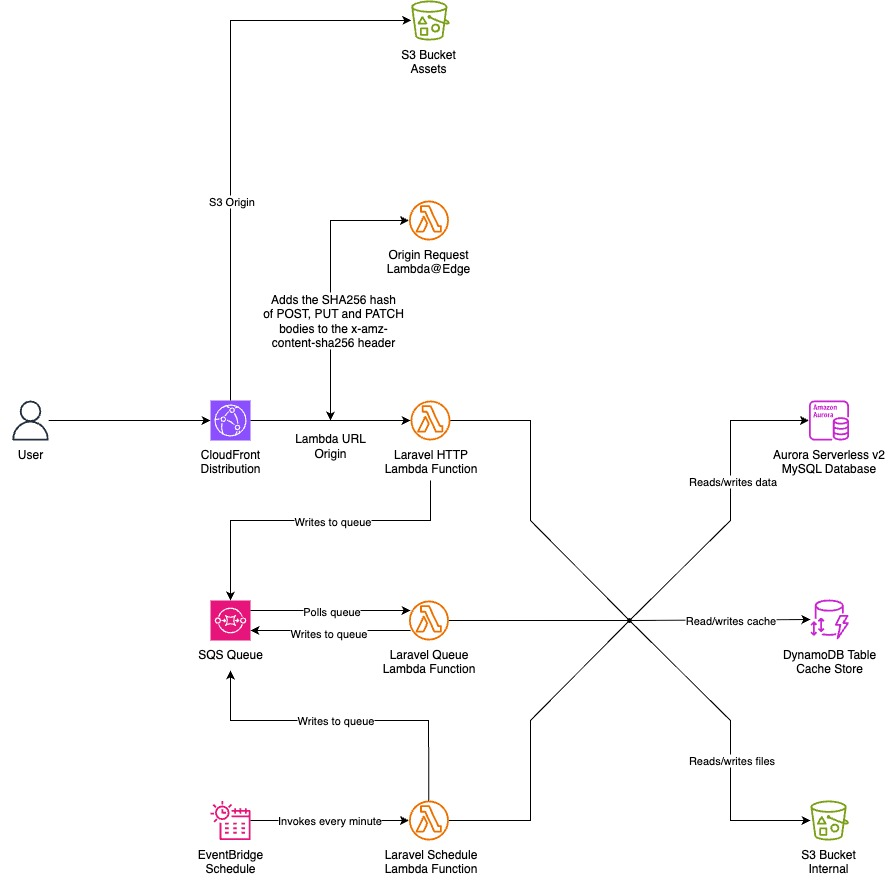

# Laravel Lambda

This repo demonstrates how to run a fully functional Laravel application in AWS Lambda. It uses the custom PHP runtimes provided by [Bref](https://bref.sh/) and defines all the AWS resources in CloudFormation.

## Architecture



This is an opinionated way to run Laravel in AWS. Others might make different decisions with certain components, but the fundamentals remain the same.

You will need three Lambda functions to run the different aspects of the application:

- **HTTP** - Laravel handles web requests
- **Queue** - Laravel handles jobs in the background
- **Schedule** - Laravel runs scheduled tasks in the background

### Web Requests

The "HTTP" Lambda function handles most web requests from users.

You can use either:

- Bref's FPM runtime if you want a more traditional PHP-FPM web server (the handler is just `public/index.php`).
- Bref's "vanilla" function runtime together with the Laravel Octane handler (`Bref\LaravelBridge\Http\OctaneHandler`).

I have opted for the latter for performance reasons. Laravel Octane allows you to boot the application once during the Lambda cold start and reuse it until the execution environment is torn down. This includes things like persistent database connections. Otherwise the whole application is set up and torn down with every request.

A function URL is used to provide a dedicated HTTP(S) endpoint for the "HTTP" Lambda function. The function URL is then used as a CloudFront origin to handle most requests.

However, the "HTTP" Lambda function cannot serve content like static assets. Your CSS, JavaScript, font and image files need to be stored in an "assets" S3 bucket. This bucket is used as another CloudFront origin.

### Queued Jobs

The "queue" Lambda function handles all queued jobs. It polls an SQS queue and processes jobs when they become available.

It uses the "vanilla" Bref function runtime with the `Bref\LaravelBridge\Queue\QueueHandler` handler.

All the Laravel-based Lambda functions can add jobs to the queue.

### Scheduled Tasks

The "schedule" Lambda function handles all scheduled tasks.

An EventBridge schedule invokes the function and runs the Laravel task scheduler every minute.

It uses Bref's console runtime with the `artisan` script as the handler.

You can also use this function to run any artisan command. You just need to invoke the function manually (for instance via the AWS console or CLI) and specify the signature of the artisan command you want to run as the event.

### Origin Request Lambda@Edge

This Lambda function is not strictly necessary, but it solves a problem created using a function URL with IAM authentication enabled.

Direct access to the Lambda URL is restricted as it uses `AWS_IAM` as the `AuthType`. CloudFront can make requests to the Lambda URL via Origin Access Control. There is a limitation here with `POST`, `PUT` and `PATCH` requests. You have to compute the SHA256 of the body and include the payload hash value of the request body in the `x-amz-content-sha256` header when sending the request to the Lambda function URL.

I have solved this here using an origin request Lambda@Edge function. However, there is a further limitation in that you can only send up to 1MB bodies to Lambda@Edge functions. Whether or not this is acceptable will depend on the nature of your application.

Alternatively you could:

- Calculate the SHA256 hash and add the `x-amz-content-sha256` header in client requests. However, this only works if you are in control of all the client requests - for instance, your application might have webhook endpoints used by third parties.
- Disable the authentication on the Lambda URL. This effectively makes the URL publicly accessible (directly rather than via CloudFront).
- Use API Gateway or an Application Load Balancer (ALB) instead of Lambda URL. (I used Lambda URL to avoid the additional complexity and costs involved with API Gateway and ALB.)

This seems like an issue AWS will fix at some point. It is not technically difficult to add the hash header but it is a pain point for customers.

### Database

The database used here is an Aurora Serverless v2 MySQL database.

In order to access the database, the Lambda functions must be in the same VPC.

### DynamoDB Cache

A DynamoDB table is used as the cache store.

It is also used to store Laravel user session data. This is important because user requests will most likely be sent to multiple Lambda execution environments - that means the `file` driver is unsuitable. By using DynamoDB, the session data is not tied to any particular Lambda execution environment. Alternatively, you could:

- Use the `cookie` driver but you would need to relax the CloudFront origin request cookie whitelist as it creates cookies with random names.
- Use the `database` driver. Just remember to create the `sessions` table.

### S3 Buckets

In addition to the "assets" S3 bucket mentioned above, this also creates an "internal" bucket.

The contents of this bucket are kept private and so it is a suitable alternative to the public-facing "assets" bucket.

## Guide

_⚠️ N.B. You will be charged for the AWS resources created by these CloudFormation templates. Although the aim is to create serverless resources that only run when required, things like the NAT Gateway and the bastion server EC2 run all the time. Do not leave resources in your account that are not in use._

### Prerequisites

You will need to install both the Bref and Laravel Bridge packages in your Laravel project:

```bash
composer require bref/bref bref/laravel-bridge --update-with-dependencies
```

You must have the [AWS CLI](https://docs.aws.amazon.com/cli/latest/userguide/getting-started-install.html) installed.

You will also need to install [`jq`](https://jqlang.org/) since the tooling in this repo parses JSON.

I have opted to use container images for the Lambda functions. You will therefore need the Docker engine installed (just use [Docker Desktop](https://www.docker.com/products/docker-desktop/)).

In the root of the repo, create your dotenv file. Enter the missing details (you will set `MFA_ID` below):

```
cp .env.example .env
```

Use the AWS console to create the CloudFormation stacks. Note that the creation order is important. The headers below include the template filename and suggested CloudFormation stack name. Some stacks names are prefixed `core` - these are for account-wide resources. Others are prefixed with `{env}-{app}`. These are for environment-scoped resources. `{env}` can be either `test` or `live`. `{app}` is just your app name - e.g. `laravel-lambda-hello-world`.

### `access-management.yml` / `core-access-management`

This creates a managed policy that restricts access to all AWS actions except those necessary to authenticate using MFA.

This is attached to an "Admin" group that you can in turn attach to an IAM user.

Now create your IAM user manually in the AWS console:

1. Head to IAM > Users > Create user. (Optionally you can enable console access.)
1. Add the new user to the "Admin" mentioned above.
1. Create an access key for the user. You should configure your local AWS CLI to use these credentials: `aws configure`
1. Assign an MFA device to the user. You should add the MFA device ARN to your `.env` file.

N.B. This is not stricly necessary, but the tooling in this repo assumes your are using an IAM user with MFA.

### `network.yml` / `core-network`

This creates a VPC with three public subnets and three private subnets.

There is an Internet Gateway for the public subnets and a NAT Gateway for the private subnets.

### `database.yml` / `{env}-{app}-database`

This creates the Aurora Serverless v2 MySQL database.

It also creates a bastion server. For this reason, you will first need to manually create a key pair to connect to the database from your local machine over SSH. In the AWS console, head to EC2 > Key Pairs > Create key pair. When you create the template, select the appropriate `BastionKeyName`.

### `buckets.yml` / `{env}-{app}-buckets`

This creates the "assets" and "internal" S3 buckets.

You will later need to specify the `CloudFrontDistributionId` parameter but you cannot do this yet.

### `queue.yml` / `{env}-{app}-{queue}`

This just creates the SQS queue.

### `dynamodb-table.yml` / `{env}-{app}-dynamodb-table`

This creates the DynamoDB table.

### `lambda-role.yml` / `{env}-{app}-lambda-role`

This creates the IAM role used by all the Laravel Lambda functions.

### `ecr-placeholder.yml` / `core-ecr-placeholder`

To create a containerised Lambda function, you need to specify an image. The CI/CD pipeline needs to be created last, so we do not yet have our images prepared. Instead, we need to create a placeholder image.

This template creates the Elastic Container Registry to store the placeholder image.

Once, the ECR is created, you will need to create the placeholder image. You can use [this tool](/scripts/build-placeholder-image/README.md).

### `http-lambda.yml` / `{env}-{app}-http-lambda`

This creates the HTTP Lambda function and URL.

### `queue-lambda.yml` / `{env}-{app}-queue-lambda`

This creates the queue Lambda function.

### `schedule-lambda.yml` / `{env}-{app}-schedule-lambda`

This creates the schedule Lambda function and EventBridge schedule.

### `origin-request-lambda.yml` / `{env}-{app}-origin-request-lambda`

N.B. This must be created in the `us-east-1` region.

This creates the origin request Lambda@Edge function.

You will now need to deploy [the code](/origin-request-lambda/) using [this tool](/scripts/deploy-origin-request-lambda/README.md).

### `cdn.yml` / `{env}-{app}-cdn`

This creates the CloudFront distribution.

This assumes you have own a domain name you can associate with the distribution.

You will also need to create a public certificate to attach to your distribution. In the AWS Console, make sure you are in the  us-east-1 region and head to Certificate Manager > Request certificate > Request a public certificate, enter your domain (or subdomain) name, and validate it. You will need to enter the certificate's ARN as the `AcmCertificateArn` in the `{env}-{app}-cdn` stack.

Once created, go back to the `{env}-{app}-buckets` stack to specify the `CloudFrontDistributionId` parameter.

You will also need to create the relevant DNS records. If using Route 53 hosted zones for your domain name, you can use the "Route domains to CloudFront" feature - this will create A and AAAA records for you.

### `cicd.yml` / `{env}-{app}-cicd`

This creates the CI/CD pipeline that deploys the Laravel project to AWS Lambda.

First, though, you will need to [connect your GitHub account](https://docs.aws.amazon.com/codepipeline/latest/userguide/connections-github.html). Head to Developer Tools via something like CodePipeline > Settings > Connections > Create connection (you will need to "Install a new app" to give it the appropriate access to your GitHub account). Once created, you will need to provide the CodeStar connection ARN as a parameter in the CloudFormation stack.

Create a `.env` file and upload it to your new config bucket. Make sure you fill in the details based on the AWS resources you created in the previous stacks.

```
APP_NAME="Laravel Lambda"
APP_ENV=<env>
APP_KEY=
APP_DEBUG=true
APP_URL=<url>

LOG_CHANNEL=stack

DB_CONNECTION=mysql
DB_HOST=<hostname>
DB_PORT=3306
DB_DATABASE=laravel_lambda
DB_USERNAME=Master
DB_PASSWORD=<password>

CACHE_DRIVER=dynamodb
SESSION_DRIVER=dynamodb
DYNAMODB_CACHE_TABLE=<DynamoDB table name>

MAIL_MAILER=ses
MAIL_FROM_ADDRESS=<email address>

QUEUE_CONNECTION=sqs
SQS_PREFIX=https://sqs.eu-west-1.amazonaws.com/<your-account-id>
SQS_QUEUE=<SQS queue name>

AWS_BUCKET=<internal bucket name>

AWS_DEFAULT_REGION=eu-west-1

BREF_LOOP_MAX=250
OCTANE_PERSIST_DATABASE_SESSIONS=1
```

The CodePipeline will be triggered by pushes to master (or whatever branch you specify in the stack). It will pull the latest changes and launch a CodeBuild job that runs the [`buildspec.yml`](/laravel/buildspec.yml) file in the Laravel source code.

## Database

You can connect to the database using database management software like [MySQL Workbench](https://www.mysql.com/products/workbench/) or [Sequel Ace](https://sequel-ace.com/).

Although the database is in a private subnet and not directly accessible from the internet, you can connect to it via SSH using the bastion server. The latter is publicly accessible over SSH, but you will need the key/pair created before you made the `{env}-{app}-database` stack.

You will need to lookup the details about the database and bastion server.

For the database credentials, head to Secrets Manager in the AWS Console. Select the secret associated with the database cluster before clicking "Retrieve secret value". This provides you with the `host`, `username`, and `password`.

Head to EC2 > Instances and select the bastion server, and copy the "IPv6 address". This is you SSH hostname. (The security group only allows SSH access via IPv6.)

The SSH user will be `ec2-user`.

The SSH key will be the key/pair you downloaded earlier.

Finally, you may need to modfy the permissions of the key/pair file:

```
chmod 400 "hello-world.pem"
```

## Caveats

You must add `URL::forceRootUrl(config('app.url'));` to the `boot` method in the `AppServiceProvider`. Otherwise, it will use the wrong hostname for assets. This is because the `Host` header is not being forwarded - this is deliberate as forwarding the `Host` header is not compatible with Lambda URL with `AWS_IAM` enabled.
